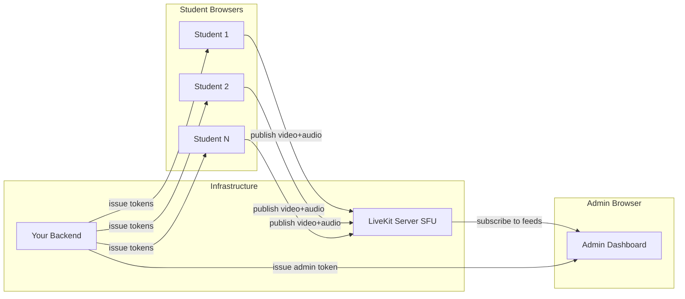
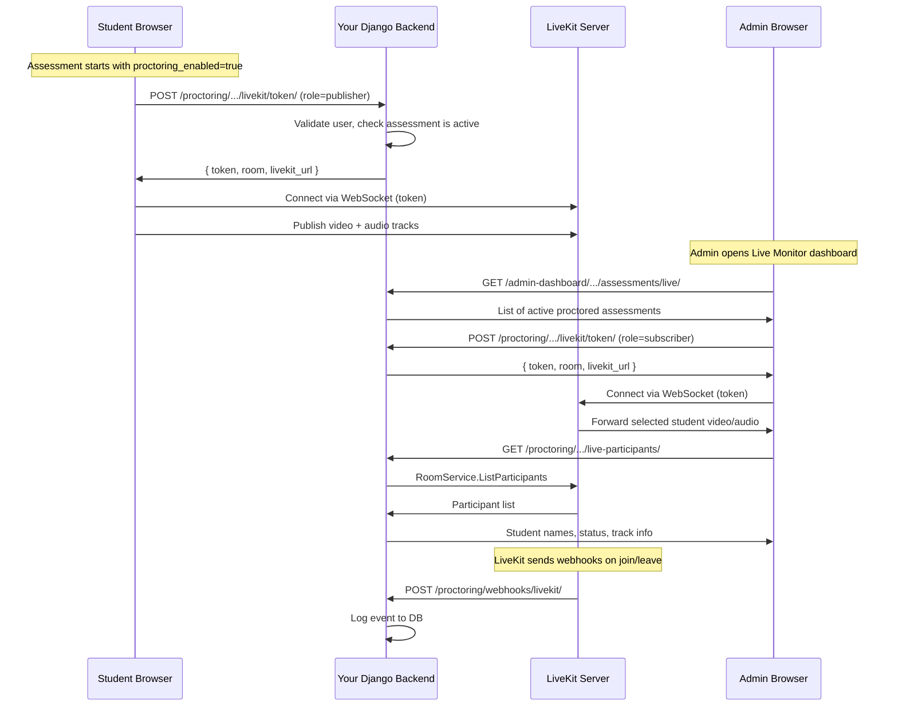

# Live Proctoring with LiveKit SFU

## Architecture Overview




**How it works:**

- Each proctored assessment gets a **LiveKit room** named by assessment ID (e.g., `proctoring-{assessmentId}`)
- Students join the room as **publishers** (camera + mic) when they start the assessment
- Admins join the same room as **subscribers** (receive-only) from the monitoring dashboard
- LiveKit handles all WebRTC negotiation, TURN/ICE, and selective forwarding
- The admin only downloads video/audio for students they are actively viewing (bandwidth-efficient)

## Backend Plan (for Backend Engineer)

### 1. LiveKit Server Setup

LiveKit is; an open-source WebRTC SFU (Selective Forwarding Unit). It receives video/audio from students and selectively forwards it to admins.

**OptionALiveKit Cloud** - [https://cloud.livekit.io](https://cloud.livekit.io) (managed, no infra to maintain, free tier available)

Either way, you get:

- An **API Key** (e.g., `APIxxxxxxx`)
- An **API Secret** (e.g., `secretxxxxxxxxxxxxxxxxxxxxxxx`)
- A **WebSocket URL** (e.g., `wss://livekit.yourdomain.com` or `wss://your-app.livekit.cloud`)

### 2. Python SDK Installation

```bash
pip install livekit-api
```

### 3. Backend Environment Variables

```
LIVEKIT_URL=wss://livekit.yourdomain.com
LIVEKIT_API_KEY=APIxxxxxxx
LIVEKIT_API_SECRET=secretxxxxxxxxxxxxxxxxxxxxxxx
```

---

### 4. API Endpoints

All endpoints use Bearer JWT auth (same as existing endpoints). Base URL pattern follows your existing convention: `{apiBaseUrl}/proctoring/api/clients/{clientId}/...`

---

#### API 1: Generate LiveKit Token

`**POST /proctoring/api/clients/{clientId}/livekit/token/**`

This is the critical endpoint. Both students and admins call this to get a short-lived token that grants them access to a LiveKit room.

**Request Headers:**

```
Authorization: Bearer <access_token>
Content-Type: application/json
```

**Request Body:**

```json
{
  "assessment_id": 42,
  "role": "publisher"
}
```

- `role`: `"publisher"` (student) or `"subscriber"` (admin)

**Backend Logic (Python/Django):**

```python
from livekit.api import AccessToken, VideoGrants
from django.conf import settings
import json

def generate_livekit_token(request, client_id):
    data = json.loads(request.body)
    assessment_id = data["assessment_id"]
    role = data["role"]  # "publisher" or "subscriber"

    user = request.user
    room_name = f"proctoring-{client_id}-{assessment_id}"

    # Validate: is this assessment active and proctoring_enabled?
    # Validate: does user have permission? (student for publisher, admin for subscriber)
    # ... your authorization logic here ...

    # Build identity and metadata
    if role == "publisher":
        identity = f"student-{user.id}"
        metadata = json.dumps({
            "name": user.get_full_name() or user.email,
            "email": user.email,
            "role": "student",
            "user_id": user.id,
        })
    else:
        identity = f"admin-{user.id}"
        metadata = json.dumps({
            "name": user.get_full_name() or user.email,
            "role": "admin",
            "user_id": user.id,
        })

    # Generate LiveKit token
    token = (
        AccessToken(settings.LIVEKIT_API_KEY, settings.LIVEKIT_API_SECRET)
        .with_identity(identity)
        .with_name(user.get_full_name() or user.email)
        .with_metadata(metadata)
        .with_grants(
            VideoGrants(
                room_join=True,
                room=room_name,
                can_publish=role == "publisher",
                can_subscribe=role == "subscriber",
                can_publish_data=role == "publisher",
            )
        )
        .with_ttl(datetime.timedelta(hours=4))  # token valid for 4 hrs
        .to_jwt()
    )

    return JsonResponse({
        "token": token,
        "room": room_name,
        "livekit_url": settings.LIVEKIT_URL,  # wss://...
        "identity": identity,
    })
```

**Response (200 OK):**

```json
{
  "token": "eyJhbGciOiJIUzI1...",
  "room": "proctoring-1-42",
  "livekit_url": "wss://livekit.yourdomain.com",
  "identity": "student-157"
}
```

**Error Responses:**

- `403` - User not authorized (not enrolled in this assessment, or not admin)
- `404` - Assessment not found or proctoring not enabled
- `400` - Assessment not currently active (outside start_time/end_time window)

---

#### API 2: List Live Participants for an Assessment

`**GET /proctoring/api/clients/{clientId}/assessments/{assessmentId}/live-participants/`**

Admin-only endpoint. Returns who is currently connected to the LiveKit room for a specific assessment.

**Request Headers:**

```
Authorization: Bearer <access_token>
```

**Backend Logic (Python/Django):**

```python
from livekit.api import LiveKitAPI
import asyncio

async def get_live_participants_async(room_name):
    api = LiveKitAPI(
        url=settings.LIVEKIT_URL,
        api_key=settings.LIVEKIT_API_KEY,
        api_secret=settings.LIVEKIT_API_SECRET,
    )
    participants = await api.room.list_participants(room=room_name)
    await api.aclose()
    return participants

def list_live_participants(request, client_id, assessment_id):
    # Admin-only authorization check
    room_name = f"proctoring-{client_id}-{assessment_id}"

    participants = asyncio.run(get_live_participants_async(room_name))

    result = []
    for p in participants:
        metadata = json.loads(p.metadata) if p.metadata else {}
        if metadata.get("role") == "student":
            result.append({
                "identity": p.identity,
                "name": p.name or metadata.get("name", "Unknown"),
                "email": metadata.get("email"),
                "user_id": metadata.get("user_id"),
                "joined_at": p.joined_at,
                "is_publishing_video": any(
                    t.source == 1  # CAMERA
                    for t in p.tracks.values()
                    if not t.muted
                ),
                "is_publishing_audio": any(
                    t.source == 2  # MICROPHONE
                    for t in p.tracks.values()
                    if not t.muted
                ),
                "connection_quality": p.connection_quality,  # 0=POOR,1=GOOD,2=EXCELLENT
            })

    return JsonResponse({
        "room": room_name,
        "participant_count": len(result),
        "participants": result,
    })
```

**Response (200 OK):**

```json
{
  "room": "proctoring-1-42",
  "participant_count": 87,
  "participants": [
    {
      "identity": "student-157",
      "name": "John Doe",
      "email": "john@example.com",
      "user_id": 157,
      "joined_at": 1712150400,
      "is_publishing_video": true,
      "is_publishing_audio": true,
      "connection_quality": 2
    }
  ]
}
```

---

#### API 3: List Live (Active) Assessments

`**GET /admin-dashboard/api/clients/{clientId}/assessments/live/**`

Admin-only. Returns assessments that are currently within their active window and have proctoring enabled. The admin uses this to see which assessments can be monitored right now.

**Backend Logic:**

```python
from django.utils import timezone

def list_live_assessments(request, client_id):
    now = timezone.now()
    assessments = Assessment.objects.filter(
        client_id=client_id,
        proctoring_enabled=True,
        is_active=True,
        start_time__lte=now,
        end_time__gte=now,
    ).values("id", "title", "slug", "start_time", "end_time", "submissions_count")

    # Optionally, query LiveKit for participant counts per room
    result = []
    for a in assessments:
        room_name = f"proctoring-{client_id}-{a['id']}"
        # Optionally get participant count from LiveKit RoomService
        result.append({
            **a,
            "room_name": room_name,
            "live_student_count": get_participant_count(room_name),  # optional
        })

    return JsonResponse({"assessments": result})
```

**Response (200 OK):**

```json
{
  "assessments": [
    {
      "id": 42,
      "title": "Data Structures Final",
      "slug": "data-structures-final",
      "start_time": "2026-04-03T10:00:00Z",
      "end_time": "2026-04-03T12:00:00Z",
      "room_name": "proctoring-1-42",
      "live_student_count": 87
    }
  ]
}
```

---

#### API 4 (Optional): Webhook Receiver for LiveKit Events

`**POST /proctoring/api/webhooks/livekit/**`

LiveKit can send webhook events when participants join/leave rooms, tracks are published/unpublished, etc. This is useful for logging and analytics.

**LiveKit Config (livekit.yaml):**

```yaml
webhook:
  urls:
    - https://yourdomain.com/proctoring/api/webhooks/livekit/
  api_key: APIxxxxxxx
```

**Backend Logic:**

```python
from livekit.api import WebhookReceiver

receiver = WebhookReceiver(
    api_key=settings.LIVEKIT_API_KEY,
    api_secret=settings.LIVEKIT_API_SECRET,
)

@csrf_exempt
def livekit_webhook(request):
    auth_header = request.headers.get("Authorization", "")
    body = request.body.decode("utf-8")

    event = receiver.receive(body, auth_header)

    # event.event can be:
    #   "participant_joined", "participant_left",
    #   "track_published", "track_unpublished",
    #   "room_started", "room_finished"

    # Log to your proctoring_events table
    ProctoringLiveEvent.objects.create(
        room=event.room.name if event.room else None,
        event_type=event.event,
        participant_identity=event.participant.identity if event.participant else None,
        timestamp=timezone.now(),
        raw_payload=body,
    )

    return JsonResponse({"status": "ok"})
```

---

### 5. Data Flow Summary




### 6. Room and Identity Naming Convention

- **Room name:** `proctoring-{clientId}-{assessmentId}` (e.g., `proctoring-1-42`)
- **Student identity:** `student-{userId}` (e.g., `student-157`)
- **Admin identity:** `admin-{userId}` (e.g., `admin-3`)
- **Metadata (JSON string):** `{ "name": "John Doe", "email": "john@example.com", "role": "student", "user_id": 157 }`

### 7. Security Checklist for Backend

- Tokens should have a TTL (4 hours max, matching assessment duration)
- Validate that the student is actually enrolled in/eligible for the assessment before issuing a publisher token
- Validate that only admins can get subscriber tokens
- Validate that the assessment is currently within its `start_time` / `end_time` window
- Students should only get `canPublish: true, canSubscribe: false` (they cannot see other students)
- Admins should only get `canPublish: false, canSubscribe: true` (receive-only)
- LiveKit webhook endpoint should verify the signature using the `WebhookReceiver` class
- Room auto-closes when all participants leave (LiveKit default behavior)

### 8. Infrastructure Requirements

- **LiveKit Server:** 2 vCPU, 4 GB RAM minimum for up to ~100 concurrent streams. Scale vertically or use LiveKit's multi-node setup for 100+ concurrent rooms
- **Ports:** 7880 (HTTP/API), 7881 (WebSocket/HTTPS), 50000-60000/UDP (WebRTC media), 3478/UDP + 5349/TCP (TURN)
- **TLS:** Required for production (WebRTC mandates HTTPS). Put behind nginx/caddy or use LiveKit's built-in TLS
- **Bandwidth estimate:** ~500 Kbps per student stream (low-res 640x480). 100 students = ~50 Mbps ingest. Admin downloads only viewed streams

## Frontend Implementation

### 1. Install dependencies

```bash
yarn add livekit-client @livekit/components-react
```

### 2. New service: LiveKit token fetcher

**File:** `[lib/services/livekit.service.ts](lib/services/livekit.service.ts)` (new)

- `getLiveKitToken(room, identity, role)` - calls backend token endpoint
- `getLiveParticipants(assessmentId)` - calls backend participant list endpoint
- Reads `NEXT_PUBLIC_LIVEKIT_URL` from env for the WebSocket URL

### 3. New hook: Student live proctoring publisher

**File:** `[lib/hooks/useLiveProctoringPublisher.ts](lib/hooks/useLiveProctoringPublisher.ts)` (new)

- On mount: fetch a publisher token, connect to the LiveKit room, publish local camera + mic tracks
- Reuses the existing `MediaStream` from `window.__assessmentStream` (set during device-check) so the student doesn't get a second camera permission prompt
- On unmount / assessment submit: disconnect from the room, stop tracks
- Exposes connection status for UI feedback (connected/reconnecting/error)

### 4. Integrate into student assessment flow

**File:** `[app/assessments/[slug]/take/page.tsx](app/assessments/[slug]/take/page.tsx)` (modify)

- When `proctoring_enabled` is true, call `useLiveProctoringPublisher` alongside the existing `useAssessmentProctoring`
- The existing client-side face detection (BlazeFace) continues to work in parallel - live streaming is additive
- Show a small "Live" indicator in the `AssessmentTimerBar` when connected to LiveKit

### 5. New admin page: Live Monitoring Dashboard

**File:** `[app/admin/assessment/[id]/live-monitor/page.tsx](app/admin/assessment/[id]/live-monitor/page.tsx)` (new)

- Fetches a subscriber token for the assessment's LiveKit room
- Connects to the room using `@livekit/components-react`'s `LiveKitRoom` component
- Displays a grid of student video tiles using `TrackLoop` / `VideoTrack` / `AudioTrack` components
- Features:
  - **Grid view**: Thumbnail tiles of all connected students (paginated for 100+)
  - **Focus view**: Click a student tile to enlarge their feed
  - **Audio toggle**: Mute/unmute individual student audio (muted by default to avoid cacophony)
  - **Student info overlay**: Name, connection quality, time elapsed
  - **Auto-refresh participant list**: LiveKit SDK fires events on participant join/leave

### 6. New admin components

**Directory:** `[components/admin/assessment/live-monitor/](components/admin/assessment/live-monitor/)` (new)

- `StudentVideoTile.tsx` - Individual student tile with video, name, status indicators
- `LiveMonitorGrid.tsx` - Responsive grid layout for multiple tiles, pagination
- `LiveMonitorToolbar.tsx` - Controls (mute all, grid size toggle, search by student name)
- `StudentFocusView.tsx` - Enlarged single-student view with audio

### 7. Admin navigation entry point

**File:** `[app/admin/assessment/page.tsx](app/admin/assessment/page.tsx)` (modify)

- Add a "Live Monitor" action button on assessments that are currently active (`start_time <= now <= end_time` and `proctoring_enabled`)
- Links to `/admin/assessment/{id}/live-monitor`

**File:** `[components/admin/assessment/AssessmentTable.tsx](components/admin/assessment/AssessmentTable.tsx)` (modify)

- Add a live indicator / button in the assessment table row for active proctored assessments

### 8. Environment configuration

**File:** `[.env.local](.env.local)` (modify)

- Add `NEXT_PUBLIC_LIVEKIT_URL=wss://your-livekit-server.com`

## Key Design Decisions

- **LiveKit room naming**: `proctoring-{assessmentId}` - one room per assessment, all students and admins for that assessment share the room
- **Participant identity**: Students use their user ID; admins use `admin-{userId}` to distinguish roles
- **Participant metadata**: JSON with `{ name, email, role }` for display on the admin side
- **Existing proctoring preserved**: BlazeFace face detection, violation logging, and screenshot capture all continue to work. Live streaming is an additional layer
- **Bandwidth optimization**: Admin subscribes to video tracks only for visible tiles (LiveKit supports adaptive subscription). Audio is off by default, toggled per student
- **Graceful degradation**: If LiveKit connection fails, the assessment continues normally - live streaming is non-blocking for the student

## File Change Summary


| File                                                              | Action                                            |
| ----------------------------------------------------------------- | ------------------------------------------------- |
| `package.json`                                                    | Add `livekit-client`, `@livekit/components-react` |
| `lib/services/livekit.service.ts`                                 | New - token + participants API                    |
| `lib/hooks/useLiveProctoringPublisher.ts`                         | New - student publisher hook                      |
| `app/assessments/[slug]/take/page.tsx`                            | Modify - integrate publisher hook                 |
| `app/admin/assessment/[id]/live-monitor/page.tsx`                 | New - admin monitoring page                       |
| `components/admin/assessment/live-monitor/StudentVideoTile.tsx`   | New                                               |
| `components/admin/assessment/live-monitor/LiveMonitorGrid.tsx`    | New                                               |
| `components/admin/assessment/live-monitor/LiveMonitorToolbar.tsx` | New                                               |
| `components/admin/assessment/live-monitor/StudentFocusView.tsx`   | New                                               |
| `app/admin/assessment/page.tsx`                                   | Modify - add live monitor link                    |
| `components/admin/assessment/AssessmentTable.tsx`                 | Modify - add live indicator                       |
| `.env.local`                                                      | Add `NEXT_PUBLIC_LIVEKIT_URL`                     |


